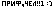

# gitdraw

рисуем монохромные картинки с разрешением 54x7 на плашке коммитов гитхуба.

для работы необходим `imagemagick`!

для создания монохромной картинки с нужным разрешением есть скрипт `miki.sh` (монохромизация и кукож изображения точка ш) - но выглядеть это будет не айс, намного лучше будет самому собрать пихельарт в фотошопе и не парится.

непосредственно всё запускает `launcher.sh`, он отматывает от текущей даты 378 дней и начинает запускать скрипт для каждого дня доходя до текущей даты.

ядром же является `gitdraw.sh`. он принимает дату в параметрах (или ставит текущую) и:

- если не смог найти конфиг `.data`, выжидает до первого дня недели (на гитхубе это воскресенье) и создавая конфиг дает первую порцию коммитов в этот день

- для последующих запусков с существующим конфигом он инкриминирует недели (при их смене в дате) относительно года и с помощью дня недели (Y) и номера недели в году (X) (двигаясь по остатку от инкремента % 54 (ширина плашки)) берет пиксель и с помощью черной магии (обратное среднее значение rgb 0-255 приведенное биекцией в количество коммитов 1-10) вычисляет количество коммитов, которое нужно сделать в этот день.

всё

## А как?

1. Создаём новую репу на гитхубе.
2. Берем этот код и инитим гит.
3. Подсовываем свое монохромное изображение (54x7) и создаем первый коммит.
4. Запускаем `launcher.sh`.
5. После завершение работы скрипта пушим всё в репу.
6.  Наслаждаемся проделанной работой как этот мужик.
